# 🍕 Pizza Billing Web Application

## 📦 **Step 1: Clone the Repository**

```bash
git clone https://github.com/FathimaHusna/pizzaBillingWeb
cd pizzaBillingWeb
```


## ⚙️ **Step 2: Set Up the Backend (Go)**

### 1️⃣ Install Dependencies  
Navigate to the backend folder and install necessary Go dependencies:

```bash
cd pizza-billing-backend
go mod tidy
```

### 2️⃣ Configure Database  
Make sure your **PostgreSQL server** is running.  
Create a database and configure it in the `db.go` file in the backend:

```go
dsn := "host=localhost user=your_user password=your_db_password dbname=your_db_name port=your_port_number sslmode=disable"
```

### 3️⃣ Run Database Migrations  
The database schema will be **automatically managed by the ORM**.  
*No manual schema setup is required.*

### 4️⃣ Run the Backend Server  
Start the Go backend server:

```bash
go run main.go
```

- Backend server will run on: [http://localhost:3000](http://localhost:3000)

---

## 🖥️ **Step 3: Set Up the Frontend (React)**

### 1️⃣ Install Dependencies  
Navigate to the frontend folder and install required Node modules:

```bash
cd pizza-billing-app
npm install
```

### 2️⃣ Configure API Base URL  
In the `src/services/Api.js` file, configure the **base URL** for the API:

```javascript
const BASE_URL = "http://localhost:3000/api";  // Go backend URL
```

### 3️⃣ Run the Frontend Development Server  
Start the React development server:

```bash
npm start
```

- Frontend will run on: [http://localhost:3001](http://localhost:3001)

---

## 🗂️ **Database Note**

The database schema is **automatically managed by the ORM** (Object-Relational Mapping) in the backend application.  
*No manual schema creation using SQL scripts is required.*

---

## 🌐 **Running the Application**

Once both servers are running, access the application in your browser:

- **Frontend:** [http://localhost:3001](http://localhost:3001)  
- **Backend:** [http://localhost:3000](http://localhost:3000)

---

## 📄 **Documentation**

- [Database Documentation](./pizza-billing-app/public/documents/db_doc.pdf)

- [Database Documentation](./pizza-billing-app/public/documents/Project_doc.pdf)


---

## 🖥️ **Screenshots**

### 🏠 Homepage  
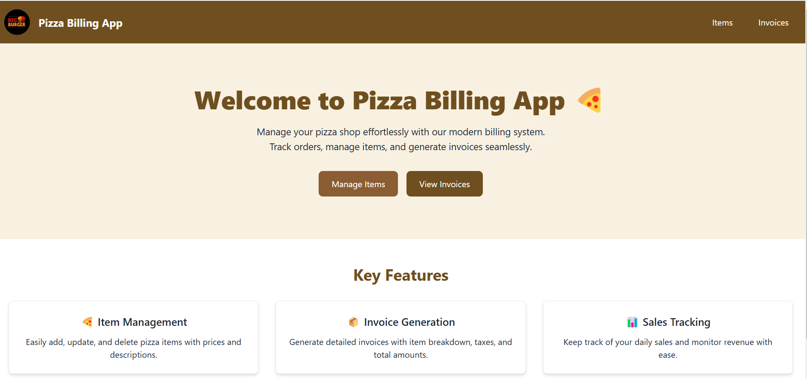

### 🍕 Items  
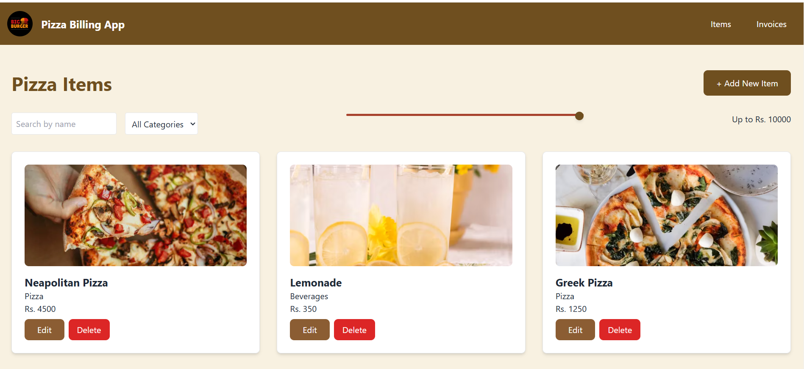  

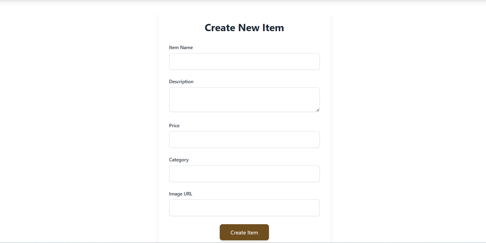 

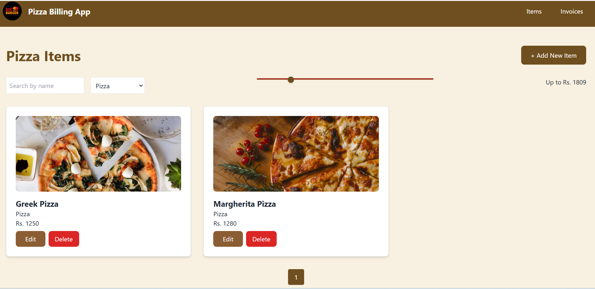

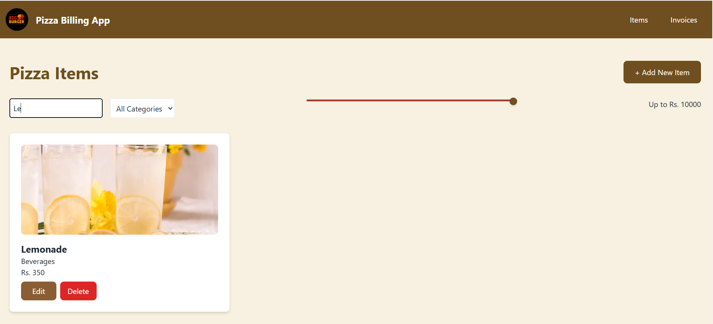 

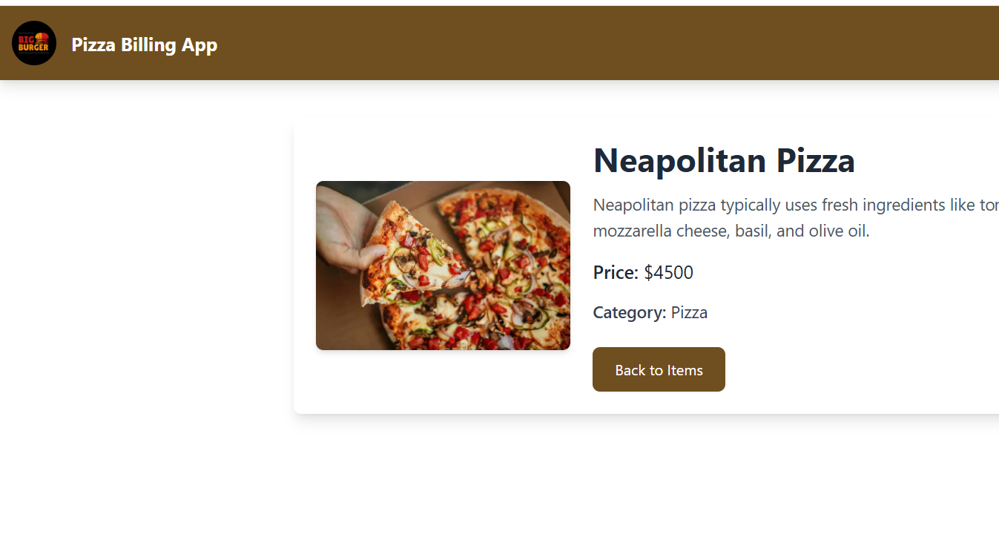 

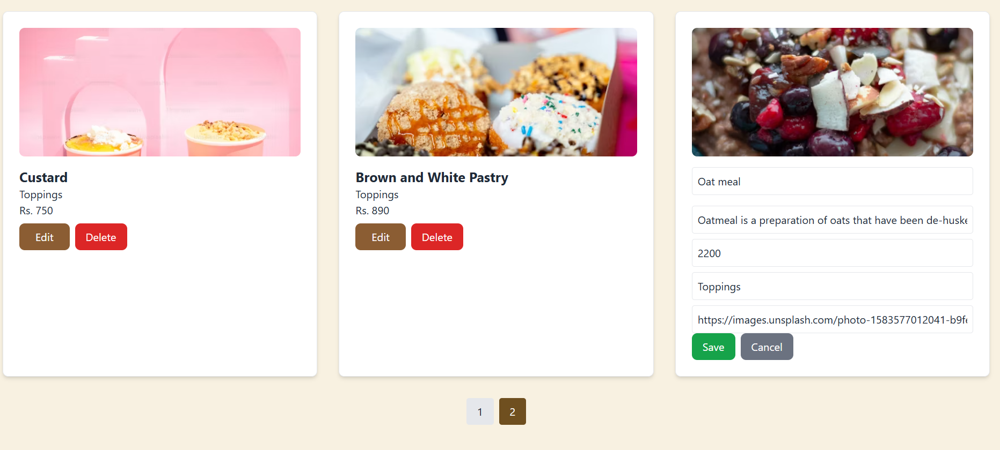  

### 🧾 Invoices  
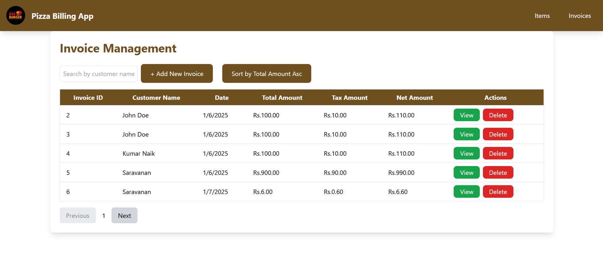

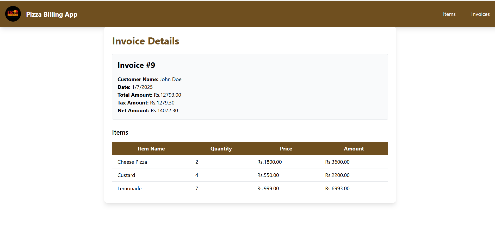

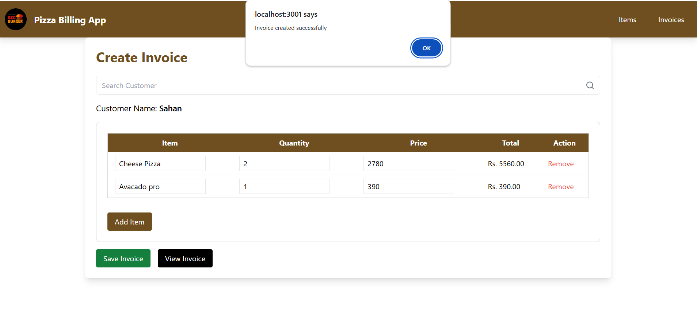

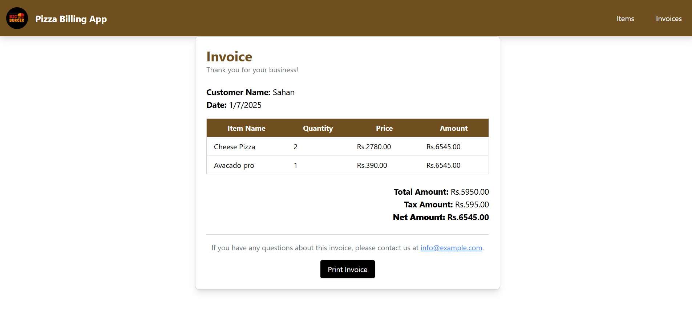
  
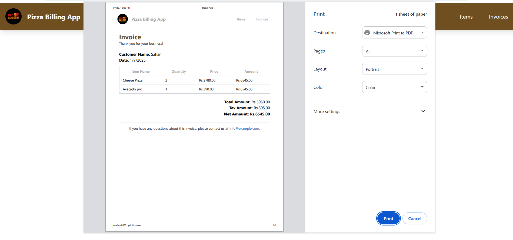  


